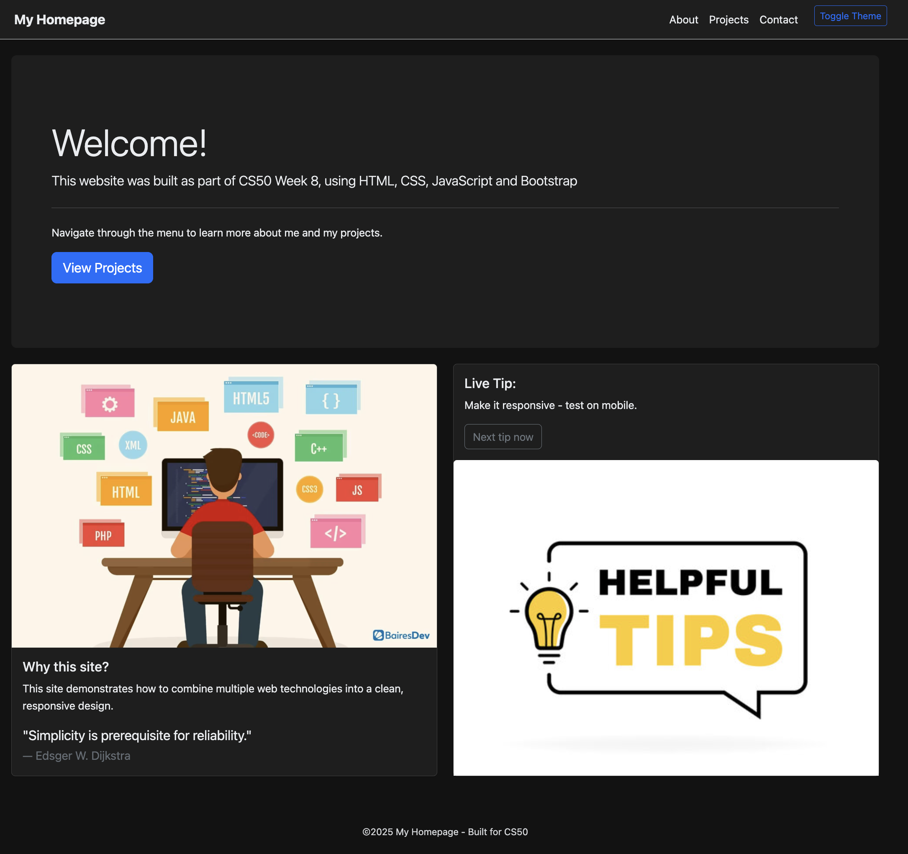
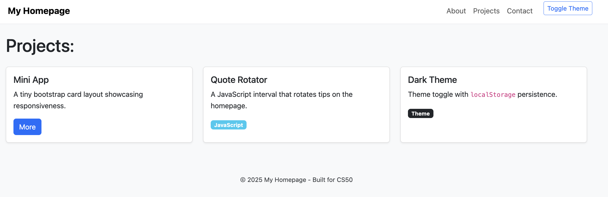
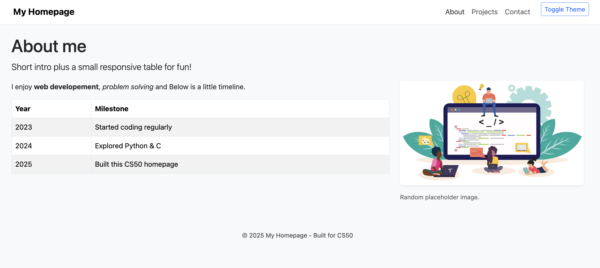
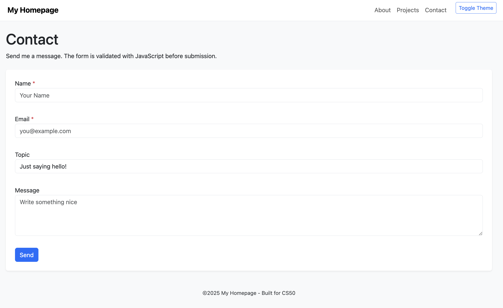

# My Homepage (CS50 Project)

This is a simple responsive website built as part of **CS50 Web track (Week 8)**.  
It demonstrates the use of **HTML5**, **CSS3**, **Bootstrap 5**, and **JavaScript** together in a clean design.

---

## Features
- **Responsive layout** using Bootstrap Grid system.
- **Navbar** with hamburger menu for small screens.
- **Light/Dark theme toggle** with CSS variables and persistence in `localStorage`.
- **Tip rotator**: automatically rotates helpful tips every 5 seconds, plus manual trigger with feedback alert.
- **Projects page** with cards, badges, and collapse components.
- **Contact form** with client-side validation and custom feedback alerts.
- **Semantic HTML5 structure**: `header`, `nav`, `main`, `section`, `article`, `footer`.

---

## Technologies Used
- **HTML5** (semantic tags)
- **CSS3** (custom properties, light/dark mode)
- **Bootstrap 5** (navbar, grid, cards, tables, buttons, alerts, collapse)
- **JavaScript (Vanilla)** (DOM manipulation, events, localStorage, validation)

---

## Project Structure
```
├── index.html
├── about.html
├── projects.html
├── contact.html
├── styles.css
├── script.js
└── specification.txt
```

---

## Specification
See [`specification.txt`](specification.txt) for the list of required HTML tags, CSS properties, and a description of how JavaScript and Bootstrap were used.

---

## Live Demo
You can view the site live via **GitHub Pages** (enable Pages in repo settings, then link here):
&rarr; [Live Demo](https://andrewkm05.github.io/cs50-homepage)

---

## Preview

### Dark Mode – Homepage


### Homepage


### Projects page


### About page


### Contact page


---

## License
This project was built for **educational purposes (CS50)** and is free to use.

---

## Notes
This project was originally developed in the **CS50 Codespace environment**, where Git commits were disabled.  
As a result, the code was later exported and uploaded here in a single commit.  
All HTML, CSS, and JavaScript code was written by me during the course exercises.

